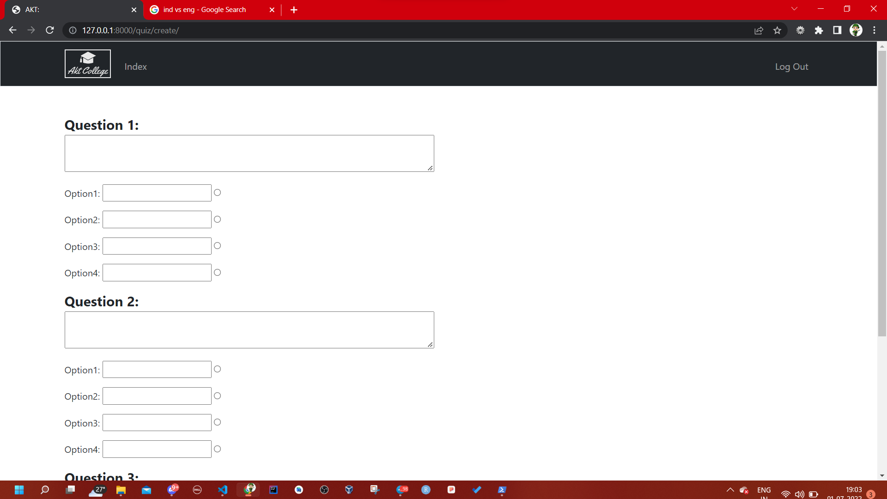

# CS50 Final Project: College Management Project
### Video Demo:  <URL HERE>
### Description: 

 

## Steps To Run The Project:

#### **Step 1:** 

Clone this repository using the following command

`git clone {repolink}`

#### **Step 2:**

Install the required packages using

`pip install -r requirements.txt`

#### **Step 3:**

Create tables in the database using following commands

`python manage.py makemigrations`

`python manage.py migrate`

#### **Step 4:**

Run django server (Be sure to be in the same directory as that of manage.py)

`python manage.py runserver`

#### **Step 5:**

Navigate to http://127.0.0.1:8000/ in your browser.

 

## Descriptions Of Pages:

**Index Page**

On this page you will have option to login as a student, teacher or admin and certain details about the college

 

 

**Login Page**

If you click on any of the options i.e. Student Login, Teacher Login or Admin Login,

you will get to see a login page which will be similar to the one shown below.

 

 

**Admin Page**

If you login as admin you will be able to do the following things:

* View all the students, teachers and branches 

* Create new students, teachers and branches

* Update the existing students, teachers and branches

* Delete the existing students, teachers and branches 

On the navbar you will have options to create student, teacher and branch

 

 

**Create Page**

If you click on *Create Student* you will get to see a form asking about the details related to student.

 

 

Once you fill the details and click on *Register* button a new Student will be created and you will be redirected to *Admin Page*.

Similar things will happen if you click on *Create Teacher* or *Create Branch*.

**Logout**

On the navbar you have an option to logout of your account as well.

Will be redirected to index page after getting logged out.

**Teacher Page**

After logging in as a teacher you will be able to:

* View you details such as name, username, email and branch.

* Take attendance.

* View the details of students.

* Create new quizes.

 

 

**Attendance Page**

If the teacher clicks on Take Attendance Button they will see the names of all the students which belong to the same branch as that of the teacher.

If the checkbox in front of the name is checked then the student will be marked present else absent.

The attendance will be updated once submit button is clicked.

 

 

**Teacher Quiz List Page**

If the teacher clicks on show quizes page, they will be able to see the quizes which were created by them.

 

 

There will be *View Results* button in front of every quiz. By clicking on which the teacher can see marks of students who attempted the quiz.

 

 

To create new quiz the teacher can click on *Create Quiz* button. 

After clicking on that button, they will be asked to fill certain details realted to quiz.

 

 

After filling in the details they can click on *Add Questions* button.

Now, they will be able asked to type the question text along with options.

The quiz will be created successfully once they click on submit button.

 

 

**Student Page**

After logging in as a Student one can:

* View their details such as name, username, email, prn, attendance, branch.

* Attempt quizes.

 

 

After clicking on `Take Quizes` Button the user will be able to see the available quizes.

The student can attempt any of the available quizes only once.

For attempting the quiz the student should click on the quiz name.

 

 

After clicking on quiz name they will get to see the questions and the time remaining for them to solve the questions.  

The answers will be submitted if the student clicks on submit button or the time is over.

 

 

After submitting the quiz the students will see the marks scored by them in the quiz.

 

 
